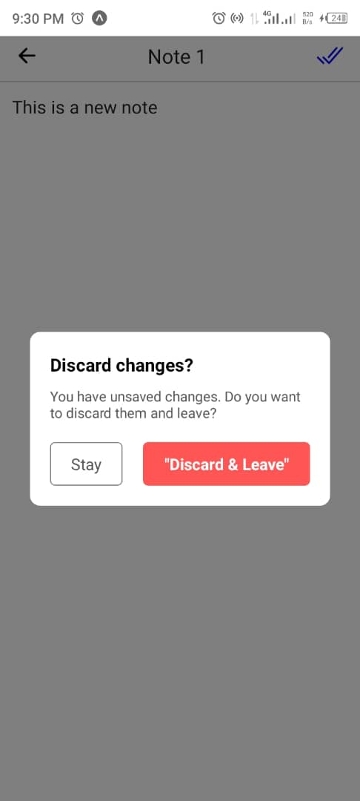

# Notes App

A simple and intuitive Notes app built with React Native. This app allows users to create, edit, delete, and organize notes with ease. Designed to be responsive and user-friendly.

## Features
- **Create Notes**: Add new notes quickly.
- **Edit Notes**: Modify existing notes with ease.
- **Delete Notes**: Remove unwanted notes.
- **Long-Press Actions**: Convenient options for managing notes.

## Tech Stack
- **Frontend**: React Native with TypeScript
- **State Management**: React Hooks (`useState`, `useEffect`)
- **Data Persistence**: AsyncStorage for offline storage.
- **Design**: Custom headers and gestures for smooth navigation.

## Setup
1. Clone the repository:
   ```bash
   git clone https://github.com/luwanise/timer-app.git
   ```
2. Install dependencies:
   ```bash
   npm install
   ```
3. Run the app:
   ```bash
   npx expo start
   ```

## Screenshots  

<p align="center">
  
  
  
</p>
<p align="center">
  
  
  
  
</p>

## Future Enhancements
- Sync with cloud storage.
- Add note-sharing functionality.

Feel free to contribute! 🚀